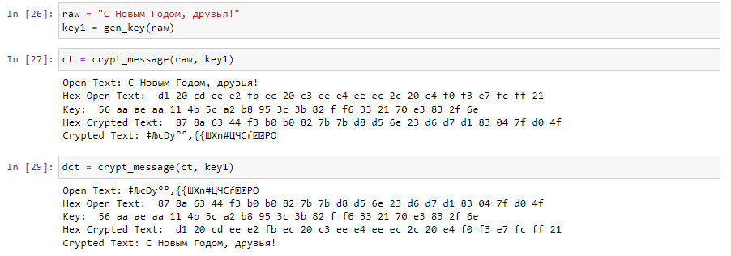
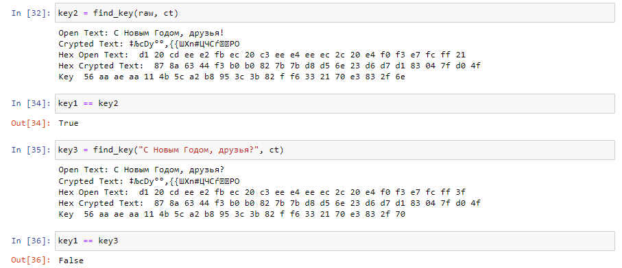

---
## Front matter
lang: ru-RU
title: "Лабораторная работа №7"
subtitle: "Однократное гаммирование"
author: "Доборщук В.В., НФИбд-01-18"
date: "11 декабря 2021"

## Formatting
toc: false
slide_level: 2
fontsize: 12pt
mainfont: PT Serif
romanfont: PT Serif
sansfont: PT Sans
monofont: Consolas
theme: metropolis
header-includes:
 - \metroset{progressbar=frametitle,sectionpage=progressbar,numbering=fraction}
 - '\makeatletter'
 - '\beamer@ignorenonframefalse'
 - '\makeatother'
aspectratio: 169
section-titles: true

---

# Цель работы

Освоить на практике применение режима однократного гаммирования.

# Выполнение лабораторной работы

Нужно подобрать ключ, чтобы получить сообщение «С Новым Годом, друзья!». Требуется разработать приложение, позволяющее шифровать и дешифровать данные в режиме однократного гаммирования. Приложение должно:

1. Определить вид шифротекста при известном ключе и открытом тексте.
2. Определить ключ, с помощью которого шифротекст может быть преобразован в некоторый фрагмент текста, представляющий собой один из возможных вариантов прочтения открытого текста

## Реализация функционала

Создали дополнительную функцию для генерации случайного ключа:

```python
def gen_key(text):
    rn = np.random.randint(0, 255, len(text))
    key = [hex(e)[2:] for e in rn]
    return key
```

## Реализация функционала

```python
def crypt_message(open_text, key):
    print(f"Open Text: {open_text}")
    hex_open_text = []
    for ch in open_text:
        hex_open_text.append(ch.encode("cp1251").hex())
    
    print("Hex Open Text: ", *hex_open_text)

    print("Key: ", *key)
    hex_crypted_text = []
    for i in range(len(hex_open_text)):
        hex_crypted_text.append("{:02x}".format(int(key[i], 16)^int(hex_open_text[i], 16)))
    
    print("Hex Crypted Text: ", *hex_crypted_text)
    crypted_text = bytearray.fromhex("".join(hex_crypted_text)).decode("cp1251")
    print(f"Crypted Text: {crypted_text}")
    
    return crypted_text
```

## Реализация функционала

```python
def find_key(open_text, crypted_text):
    print(f"Open Text: {open_text}\nCrypted Text: {crypted_text}")
    hex_open_text = []
    for ch in open_text:
        hex_open_text.append(ch.encode("cp1251").hex())
        
    hex_crypted_text = []
    for ch in crypted_text:
        hex_crypted_text.append(ch.encode("cp1251").hex())
        
    print("Hex Open Text: ", *hex_open_text)
    print("Hex Crypted Text: ", *hex_crypted_text)
    
    key = [hex(int(i,16)^int(j,16))[2:] for (i,j) in zip(hex_open_text, hex_crypted_text)]
    print("Key ", *key)
    
    return key
```

## Проверка шифрования

С помощью реализованного функционала проверяем работоспособность нашего приложения:

{width=50%}

Все корректно отрабатывает с одним и тем же ключом.

## Проверка ключа

В конце проверяем совпадают ли полученный ключ для идентичного и неидентичного текста и начальный ключ.

{width=50%}

Получили, что для идентичного текста ключи совпадают, а для неидентичного, соответственно, не совпадают.

# Заключение

Мы изучили на практике применение режима однократного гаммирования.